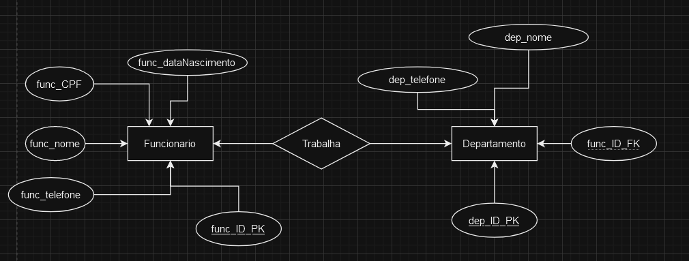
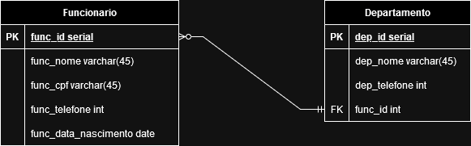
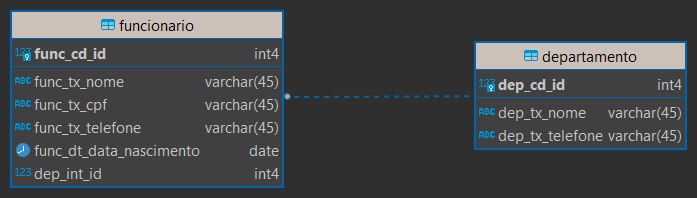

<h1 align="center">👨‍💻 Banco De Dados 👨‍💻</h1>

<h2>Relacionamento entre funcionario - departamento</h2>

<h3><b>Contexto:</b></h3>
* Existem vários departamentos dentro de uma empresa de contabilidade. 
Cada departamento tem diversos empregados, que pertencem somente a um departamento cada. 
Cada funcionário tem o seu nome, CPF, data de nascimento e número de telefone, e todos eles têm um ID único que os identifica dentro da empresa. 
O Departamento tem seu próprio nome e o número de telefone específico daquele departamento, 
além do ID único que identifica o departamento na empresa. Com base nisso, criei este relacionamento:

<h3><b>Modelo Conceitual:</b></h3> 

 

<h3><b>Modelo Lógico:</b></h3> 

 

<h3>Resultado final:</h3>  

<h3><b>Conclusão:</b></h3>

Mudei a chave estrangeira para o funcionário para poder saber em qual departamento ele pertence. Exemplo do banco sendo executado:

